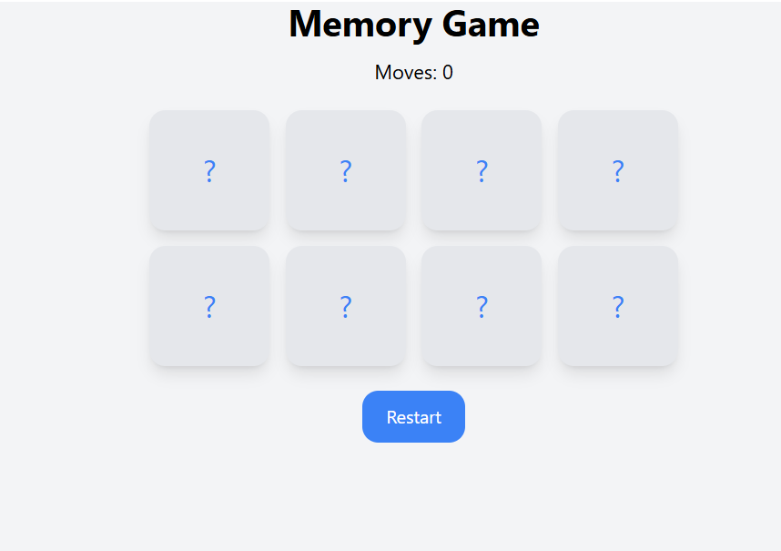
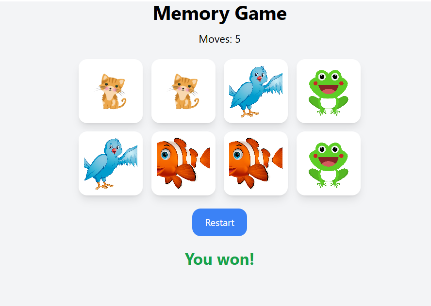

# 🎮 React Memory Game

A classic memory card game built with React and styled with Tailwind CSS. Test your memory by matching pairs of cards!

## 🚀 Live Demo

[Play the game here](https://martin-frei.github.io/react_flippcards)

## 📸 Screenshots

### Start Page


### You Won!


## 🎯 Features

- 🃏 8 cards (4 pairs) to match
- 📊 Move counter to track your performance
- 🔄 Restart button to play again
- ✨ Smooth flip animations
- 🎨 Clean, modern UI with Tailwind CSS
- 📱 Responsive design

## 🛠️ Technologies Used

- **React** - UI library
- **Tailwind CSS** - Styling
- **GitHub Pages** - Deployment

## 🏃‍♂️ Run Locally

1. Clone the repository
```bash
git clone https://github.com/Martin-Frei/react_flippcards.git
cd react_flippcards
```

2. Install dependencies
```bash
npm install
```

3. Start the development server
```bash
npm start
```

4. Open [http://localhost:3000](http://localhost:3000) in your browser

## 📦 Build for Production
```bash
npm run build
```

## 🚀 Deploy to GitHub Pages
```bash
npm run deploy
```

## 📝 How to Play

1. Click on any card to flip it
2. Click on a second card to find its match
3. If the cards match, they stay flipped
4. If they don't match, they flip back after 1 second
5. Match all pairs to win!
6. Use the Restart button to play again

## 👨‍💻 Author

**Martin Frei**
- GitHub: [@Martin-Frei](https://github.com/Martin-Frei)

## 📄 License

This project is open source and available under the MIT License.